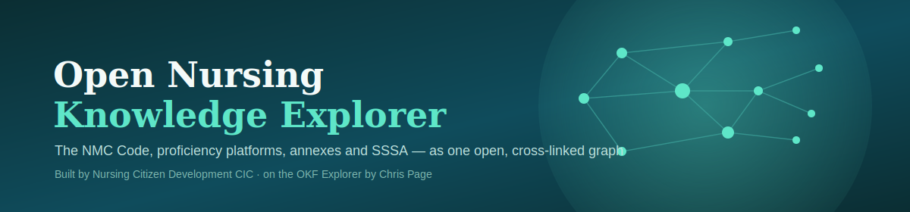
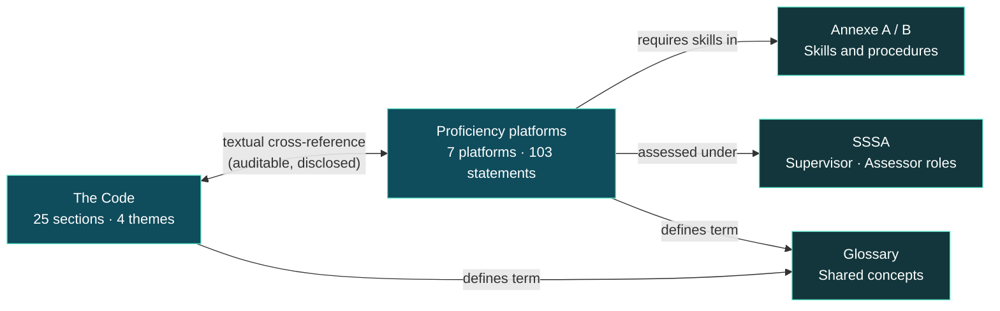

<p align="center">
  
</p>

<p align="center">
  <a href="https://clinical-quality-artifical-intelligence.github.io/open-nursing-explorer/"></a>
  <a href="https://github.com/Clinical-Quality-Artifical-Intelligence/open-nursing-explorer/actions/workflows/pages.yml"></a>
  
  
  <a href="LICENSE.md"></a>
  <a href="LICENSE-APP.md"></a>
</p>

<p align="center">
  The NMC professional standards — <b>the Code</b> (25 sections, 4 themes), the seven
  <b>Future Nurse proficiency platforms</b> plus <b>Annexe A</b> and <b>Annexe B</b>, and the
  <b>SSSA</b> — as a single searchable, cross-linked knowledge graph.
</p>

<p align="center">
  <a href="https://clinical-quality-artifical-intelligence.github.io/open-nursing-explorer/"><b>→ Open the live explorer</b></a>
</p>

---

### Contents

[Why this exists](#why-this-exists) · [How it fits together](#how-it-fits-together) · [How the Code cross-reference works](#how-the-code-cross-reference-works) · [What's here](#whats-here) · [Run locally](#run-locally) · [Rebuild](#rebuild-after-editing-content) · [Keeping this current](#keeping-this-current) · [Credits](#credits-and-original-idea)

## Why this exists

Every three years, every nurse, midwife and nursing associate revalidates against
**the Code** — but the Code, the proficiency platforms a student was assessed
against, and the SSSA framework that governed who signed them off live as three
disconnected PDFs with no visible links between them. This project makes those
links explicit, navigable, and machine-readable.

> [!NOTE]
> That matters more than usual right now. NHS England's [10 Year Health Plan for England: Fit for the Future](https://www.gov.uk/government/publications/10-year-health-plan-for-england-fit-for-the-future) (2025) commits to three shifts — hospital to community, analogue to digital, and sickness to prevention — and names a specific role for AI in that shift, including ambient AI scribing and clinician-support tools. Every nursing AI tool built on top of that shift (documentation copilots, reflective-account assistants, standards Q&A) is only as good as its underlying knowledge structure. Feed an AI three disconnected PDFs and it guesses at the connections. Feed it an open, structured, linked dataset and it doesn't have to. This project is that structured layer — open infrastructure, not a walled product.

## How it fits together



Use the app's own **graph view** to explore the live version of this diagram at node level.

## How the Code cross-reference works

> [!IMPORTANT]
> There is **no official NMC crosswalk** published between the proficiency platforms and the Code. The links shown on this site are computed, not asserted.

`build_nmc_bundle.py` matches disclosed keyword/phrase evidence (`CODE_KEYWORDS`)
between the text of each proficiency statement and the text of each Code section,
using word-boundary matching to avoid false hits (e.g. the word "refer" must not
match inside "preferences"). Every cross-reference shown on a platform or Code
section page quotes the specific statement number and the matched phrase, so the
reasoning is auditable rather than taken on trust.

<details>
<summary>Sections with no match, and why that's the point</summary>

<br>

Code sections 3, 5, 8, 12, 21 and 24 have no textual match to any proficiency
statement, as of this build — and that absence is shown, not papered over. The
method is intentionally sparse and honest rather than forced to cover everything.

Annexe A and B get a small number of **manually curated** cross-references
instead (quoting the specific item and the Code wording it echoes), since they're
procedural skill lists rather than prose proficiency statements the keyword
matcher is tuned for.

</details>

## What's here

| Path | What it is |
|---|---|
| `_site/` | **The finished static site.** Serve this folder anywhere — no server code, no database. |
| `corpus/` | The generated markdown corpus (58 nodes: root, `code/`, `platforms/`, `annexes/`, `sssa/`, `glossary/`) with YAML frontmatter and cross-links. |
| `okf-bundle.json` | The OKF bundle (schema `okf-explorer-bundle.v0`): 58 nodes, ~295 typed edges (`textual cross-reference`, `requires skills in`, `defines term`, `lists`, `related`). |
| `build_nmc_bundle.py` | Regenerates `corpus/` **and** `okf-bundle.json` from the NMC skill files plus the Annexe A/B text transcribed from the NMC's published PDF. |

## Run locally

```sh
python3 -m http.server 4173 --directory _site
# open http://localhost:4173
```

Deep links work: `/#code/section-14.md`, `/?q=candour`, `/?view=graph`.

## Rebuild after editing content

1. Edit the source data in `build_nmc_bundle.py` (glossary, SSSA text, Annexe
   text, `CODE_KEYWORDS`) or the parsed skill files, then:
   ```sh
   python3 build_nmc_bundle.py && cp okf-bundle.json _site/
   ```
2. The explorer app itself only needs rebuilding if you change the app. It comes
   from [chris-page-gov/okf-explorer](https://github.com/chris-page-gov/okf-explorer)
   `apps/okf-explorer` with **one patch**: `DEFAULT_BUNDLE = './okf-bundle.json'`
   in `src/routes/+page.svelte` (was the author's remote demo bundle). Build with
   `pnpm install && pnpm build`, copy `build/` over `_site/` (keep
   `okf-bundle.json`, `okf-registry.json` and the corpus folders).

<details>
<summary>Gotchas discovered while building</summary>

<br>

- The app reads edges from a **`relationships`** key on each corpus, not `edges`.
  The bundle emits both.
- Node `aliases` must be an **array of strings**. The upstream sample bundle uses a
  semicolon-joined string; feeding that to the app crashes search (`aliases.map` on
  a string) — any URL with `?q=` shows "No bundle loaded".
- The app reads the query from a `q` URL param, not `query` — `?q=candour`, not
  `?query=candour`.
- Do **not** `git init` this folder on an ExFAT drive: AppleDouble `._*` files
  corrupt git packs.

</details>

## Keeping this current

The Code and the Future Nurse standards are periodically reviewed by the NMC.
**This repository will be updated whenever the NMC publishes a revised Code,
revalidation requirements, or revised proficiency standards** — the corpus is
generated from a build script, so a re-run against updated source text produces
a new release rather than a manual rewrite. Check the
[commit history](https://github.com/Clinical-Quality-Artifical-Intelligence/open-nursing-explorer/commits/main)
for the latest version and its build date.

## Deployment

Live on GitHub Pages, deployed by [`.github/workflows/pages.yml`](.github/workflows/pages.yml)
on every push to `main`. The site is fully static (relative paths), so it would
work equally well on Azure Static Web Apps or Hugging Face Spaces.

## Credits and original idea

This project is built entirely on top of the [OKF Explorer](https://github.com/chris-page-gov/okf-explorer),
an open-source Open Knowledge Format viewer created by **Chris Page**
([@chris-page-gov](https://github.com/chris-page-gov)). The knowledge-bundle format,
the graph/reader/timeline app, and the design of a cross-linked open-standards
corpus are his idea and engineering — used here under his project's MIT licence.
What's new in this repository is the NMC content itself: the corpus, the Code
cross-reference methodology, and its application to UK nursing regulation.

## Licence / attribution

Explorer app: [chris-page-gov/okf-explorer](https://github.com/chris-page-gov/okf-explorer),
MIT licensed — see [LICENSE-APP.md](LICENSE-APP.md).
NMC standards content © Nursing and Midwifery Council; summarised here for
educational use with links to source documents — see [LICENSE.md](LICENSE.md).

<p align="center">
  <sub>An open resource from Nursing Citizen Development CIC. Always refer to <a href="https://www.nmc.org.uk/standards/">nmc.org.uk/standards</a> for the authoritative text.</sub>
</p>
